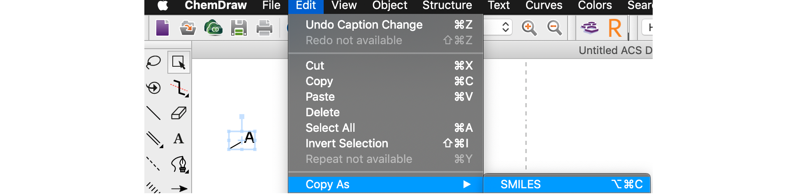

# ffunc

*F*ast molecule *func*tionalisation
***

## About
_ffunc_ is a Python tool for performing fast functionalisation of 3D molecules. Given
a [.xyz](https://en.wikipedia.org/wiki/XYZ_file_format) file functionalisation is performed
by specifying monovalent atoms in the structure to swap for a set of fragments given as their
corresponding SMILES strings. Possible use cases include catalyst functionalisation, ligand
modification and combinatorial molecule generation.

***
## Installation
First, clone this repository:
```
git clone https://github.com/duartegroup/ffunc.git
```
and `cd` into the top level ffunc directory:
```
cd ffunc/
```
_ffunc_ depends on [RDKit](https://www.rdkit.org), [numpy](https://numpy.org)/[scipy](https://www.scipy.org) 
and [NetworkX](https://networkx.github.io) and can be installed easily using a conda 
([anaconda](https://www.anaconda.com/distribution/) or [miniconda](https://docs.conda.io/en/latest/miniconda.html)) 
installation with:

```
conda install --file requirements.txt
```
Finally, install with:
```
python setup.py install
```

***
## Usage
_ffunc_ may be imported as a Python module or used directly from the command line (with more limited
functionality). _ffunc_ is added to your _conda/bin_ folder such that it can be executed anywhere
 
### 0. Toluene 
To functionalise benzene with a methyl generating a toluene molecule the SMILES string of the methyl group 
is required. From Chemdraw
 


To modify the 3D benzene structure in _examples/_ by replacing the first hydrogen atom (number 7) with a methly
```
ffunc examples/benzene.xyz -a 7 -s C[*]
```
which will generate a benzene_mod.xyz file in the _examples/_ directory. Alternatively, in a Python script 

```python
from ffunc import CoreMolecule, CombinedMolecule

benzene = CoreMolecule(xyz_filename='examples/benzene.xyz', atoms_to_del=[7])
toluene = CombinedMolecule(core_mol=benzene, frag_smiles='C[*]', name='toluene')
toluene.print_xyz_file()
```
which will generate a more helpfully named toluene.xyz file in the current working directory.

### 1. _p_-Xylene
Multiple atoms can be modified with the same fragment from the command line with 
```
ffunc examples/benzene.xyz -a 7 10 -s C[*]
```
which swaps two para hydrogens to methyls and generates benzene_mod.xyz as _p_-xylene.


### 2. Dimethylphenylphosphine

Multiple modifications are available using the Python module. To generate dimethylphenylphosphine
from PH<sub>3</sub> 

```python
from ffunc import CoreMolecule, CombinedMolecule

ph3 = CoreMolecule(xyz_filename='examples/PH3.xyz', atoms_to_del=[2, 3, 4])
dimphp = CombinedMolecule(core_mol=ph3, frag_smiles_list=['C[*]', 'C[*]', '[*]C1=CC=CC=C1'], name='dimphp')
dimphp.print_xyz_file()
```

Note that the functionalisations are made in order so atoms 2 and 3 will be replaced with methyls 
and atom 4 with a phenyl.
