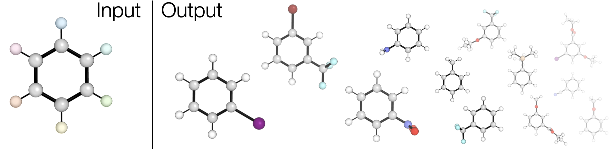

[](https://github.com/duartegroup/molfunc/actions/workflows/pytest.yml) [](https://github.com/duartegroup/molfunc/actions/workflows/catch2.yml) [](https://codecov.io/gh/duartegroup/molfunc) [](https://badge.fury.io/py/molfunc) [](https://opensource.org/licenses/MIT)



# molfunc

## About
**molfunc** is a Python tool for *func*tionalisation of 3D molecules. Given a
[.xyz](https://en.wikipedia.org/wiki/XYZ_file_format) file molecular functionalisation is performed
by specifying monovalent atoms in the structure to swap for a set of fragments given as their
corresponding SMILES strings. The energy of the combined molecule is minimised with purely rigid body rotations,
as such, generated structures may require further (constrained) optimisation. Possible 
use cases include catalyst functionalisation, ligand modification and combinatorial molecule generation.

## Installation
```
pip install molfunc==2.0.0b0
```
The old Python/Cython [version](https://github.com/duartegroup/molfunc/tree/v1) is still available with `pip install molfunc=1.0.0`. Alternatively, to install from source:
```
git clone https://github.com/duartegroup/molfunc.git
cd molfunc/
pip install Cython
python setup.py install
```

> **_NOTE:_**  Requires a modern C++ compiler.

## Usage
**molfunc** provides a minimal Python API and core CLI. To convert PH<sub>3</sub> to PMe<sub>3</sub> in Python:

```python
from molfunc import print_combined_molecule

print_combined_molecule(core_xyz_filename='examples/PH3.xyz', 
                        atoms_to_del=[2, 3, 4],
                        frag_names=['Me'],
                        name='PMe3')
```

or from the command line:

```
molfunc examples/PH3.xyz -a 2 3 4 -f Me
```

where in both cases all hydrogen atoms (atom indexes 2, 3, 4) are swapped for methyls. See *examples/* 
for more examples. Functionalising with all combinations of fragments is also possible with

```
molfunc examples/PH3.xyz -a 2 --all
```


## Citation

If **molfunc** us used in a publication please consider citing the [autodE paper](https://doi.org/10.1002/anie.202011941) where it's outlined:

T. A. Young, J. J. Silcock, A. J. Sterling, F. Duarte, *Angew. Chem. Int. Ed.*, 2021, **60**, 4266.

