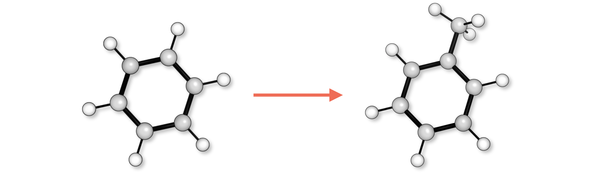
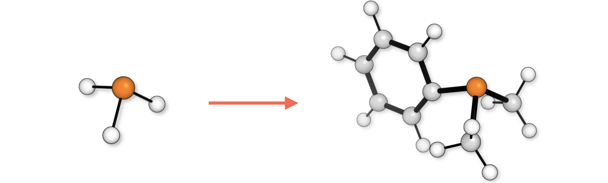

### Introduction

Functionalisation of a core structure requires a .xyz file of the core and either (1) the name of the fragment, which
is present in the fragment library

```python
from molfunc import fragment_names
print(fragment_names)
# ['bz', 'oph', 'co2me', 'bn', 'oh', 'ac', 'tf', 'ms', 'me', 'cn', 'boc', 'cl', 'i', 'h', 
# 'otbu', 'ph', 'ome', 'tms', 'et', 'nme2', 'nh2', 'tbu', 'co2et', 'br', 'ipr', 'f', 'no2', 'ch2oh', 'mes', 'cf3']
```

or (2) a .xyz file of a fragment containing a single 'R' atom which will be swapped for the core or (3) a SMILES
string generated with e.g. ChemDraw


this requires an [autodE](https://github.com/duartegroup/autodE) installation.

> **_NOTE:_**  The following examples assume this directory is the current working directory.


### 0. Toluene 


To functionalise benzene by replacing the first hydrogen atom (number 7) with a methyl group generating toluene
```
molfunc benzene.xyz -a 7 -f Me
```
which will generate a benzene_mod.xyz file in the _examples/_ directory. Alternatively, in a Python script

```python
from molfunc import print_combined_molecule
print_combined_molecule(core_xyz_filename='benzene.xyz',
                        atoms_to_del=[7],
                        frag_names=['Me'],
                        name='toluene')
```
which will generate toluene.xyz file in the current working directory.

### 1. _p_-dibromobenzene
Multiple atoms can be modified with the same fragment, from the command line 
```
molfunc benzene.xyz -a 7 10 -f Br
```
which swaps two para hydrogens to methyls and generates benzene_mod.xyz as _p_-dibromobenzene.


### 2. Dimethylphenylphosphine


Multiple modifications are also possible. To generate dimethylphenylphosphine
from PH<sub>3</sub> 

```
molfunc PH3.xyz -a 2 3 4 -f Me Me Ph
```

Note that the functionalisations are made in order so atoms 2 and 3 will be replaced with methyls 
and atom 4 with a phenyl.


### 4. Random substitution 
Random substitutions can be made, for example

```python
import numpy as np
from molfunc import print_combined_molecule, fragment_names

print_combined_molecule(core_xyz_filename='benzene.xyz',
                        atoms_to_del=[7, 9, 11],
                        frag_names=np.random.choice(fragment_names, size=3),
                        name='benzene_random_subst')
```

#### 5. Fragments from files
Fragments can also be generated from xyz files. They must contain an 
'R' atom which will be swapped for the core molecule. For example, to
generate toluene 

```python
from molfunc import print_combined_molecule

print_combined_molecule(core_xyz_filename='benzene.xyz',
                        atoms_to_del=[7],
                        frag_xyz_filenames=['methyl.xyz'],
                        name='toluene')
```
